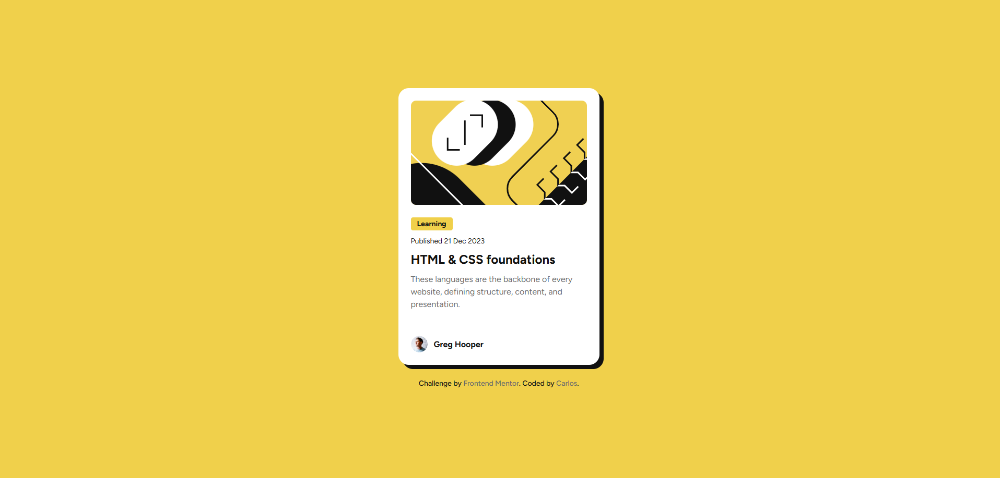

# Frontend Mentor - Solução para o cartão de prévia de blog

Esta é uma solução para o [desafio do cartão de prévia de blog no Frontend Mentor](https://www.frontendmentor.io/challenges/blog-preview-card-ckPaj01IcS). Os desafios do Frontend Mentor ajudam a melhorar suas habilidades de desenvolvimento ao criar projetos realistas.

## 🗂 Tabela de conteúdos

- [Visão geral](#visão-geral)
  - [O desafio](#o-desafio)
  - [Captura de tela](#captura-de-tela)
  - [Links](#links)
- [Meu processo](#meu-processo)
  - [Construído com](#construído-com)
  - [O que aprendi](#o-que-aprendi)
  - [Desenvolvimento contínuo](#desenvolvimento-contínuo)
  - [Recursos úteis](#recursos-úteis)
- [Autor](#autor)
- [Agradecimentos](#agradecimentos)

## 📌 Visão geral

### O desafio

Os usuários devem ser capazes de:

- Ver os estados de foco e hover para todos os elementos interativos da página

### 📷 Captura de tela



### 🔗 Links

- URL da solução: [https://github.com/slayer-br/blog-preview-card](https://github.com/slayer-br/blog-preview-card)
- Site ao vivo: [https://slayer-br.github.io/blog-preview-card](https://slayer-br.github.io/blog-preview-card)

## 🚀 Meu processo

### 🛠 Construído com

- HTML5 semântico
- CSS3 com variáveis customizadas
- Flexbox e Grid Layout
- Layout responsivo (media queries)
- Fonte do Google Fonts: Figtree
- Workflow mobile-first

### 🧠 O que aprendi

Durante este desafio, pratiquei a criação de layouts responsivos utilizando CSS puro, com foco no uso de variáveis CSS, Flexbox, e boas práticas semânticas no HTML. Também trabalhei microinterações com `hover` para tornar a experiência mais fluida e interessante.

```css

  .card {
    transition: all ease 0.2s;

    &:hover {
      box-shadow: 16px 16px 0px var(--gray-950);

      .card-body {
        .card-title {
          color: var(--main-bg-color);
          cursor: pointer;
        }
      }
    }
  }

```

### 🔄 Desenvolvimento contínuo

Quero continuar aprofundando minha experiência com CSS Grid, animações mais suaves e boas práticas de acessibilidade (como foco visível e navegação por teclado).

### 📚 Recursos úteis

- [Guia CSS Flexbox – CSS Tricks](https://css-tricks.com/snippets/css/a-guide-to-flexbox/)
- [Guia Grid Layout – MDN](https://developer.mozilla.org/pt-BR/docs/Web/CSS/CSS_grid_layout)
- [Guia de fontes do Google Fonts](https://fonts.google.com/)

## 👨‍💻 Autor

- Github - [@slayer-br](https://github.com/slayer-br)
- Frontend Mentor - [@slayer-br](https://www.frontendmentor.io/profile/slayer-br)

## 🙌 Agradecimentos

Desenvolvido com base no desafio do Frontend Mentor. Agradecimentos à comunidade que compartilha soluções incríveis — elas serviram de referência e inspiração para meu aprendizado.